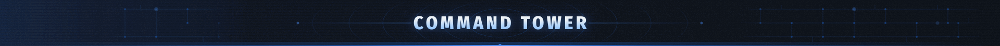
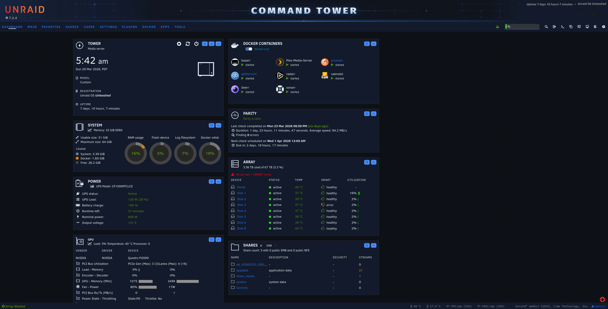
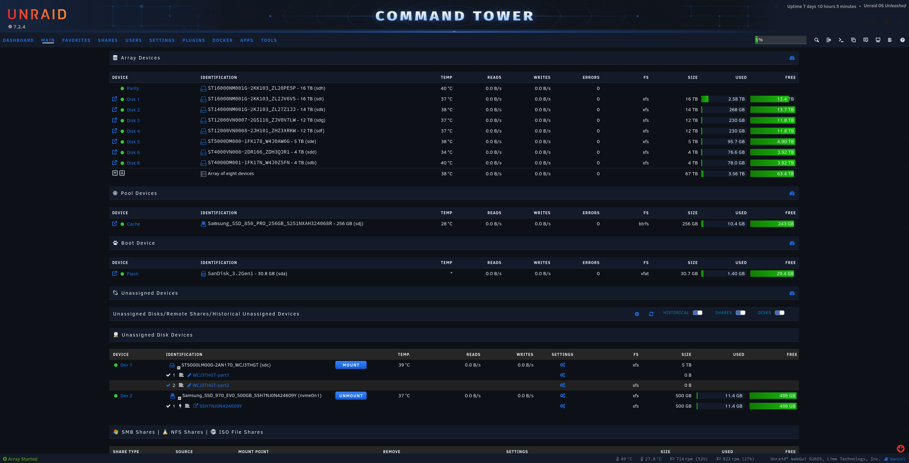
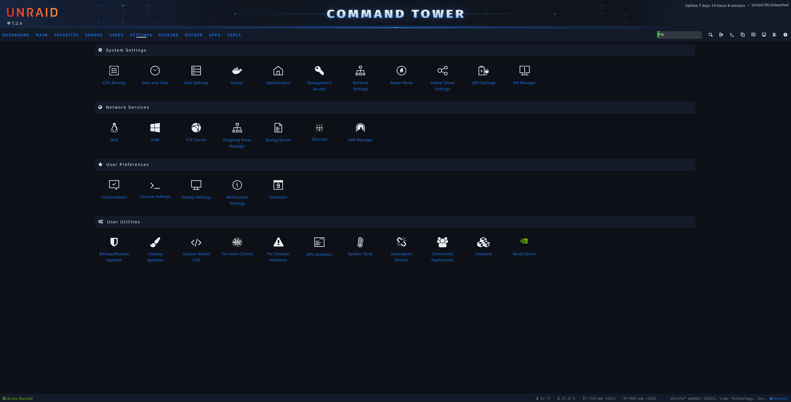
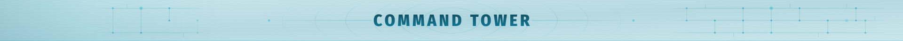
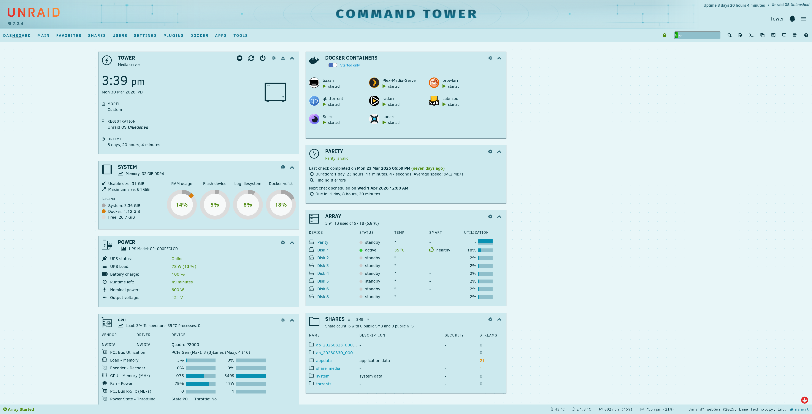
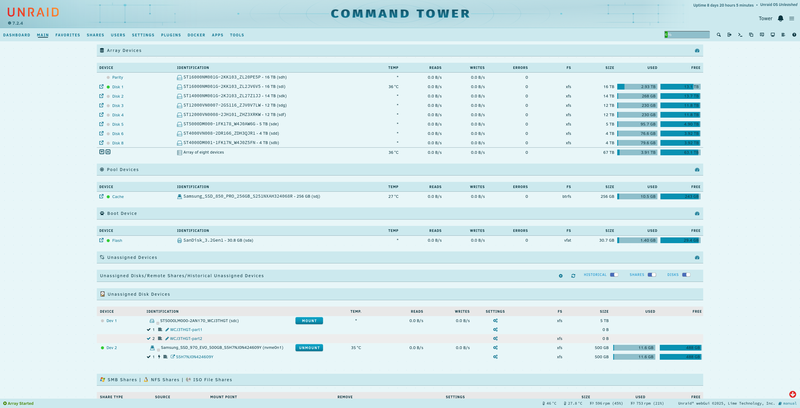
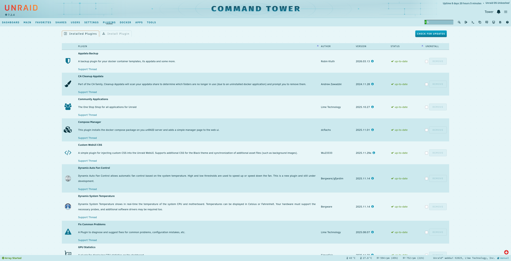
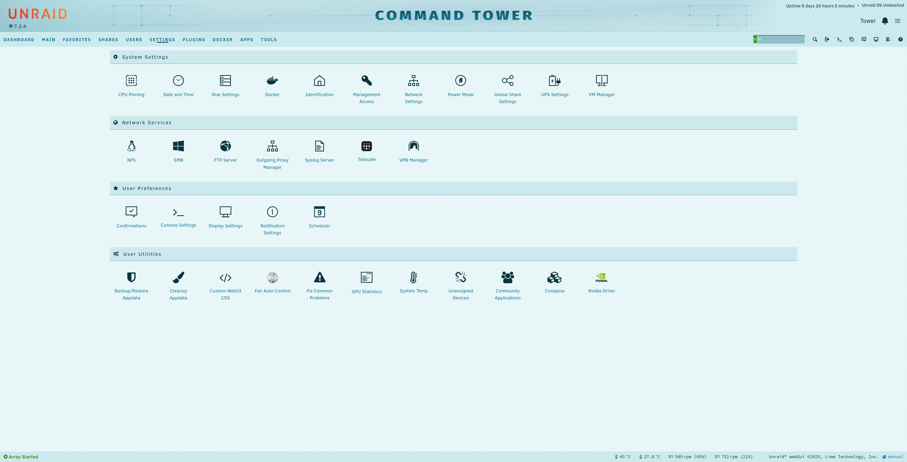

  

<h1 align="center">Meridian</h1>

  An atmospheric dark theme for Unraid built on a deep navy palette with cobalt accents.

  
  
  

---

## Screenshots

  
   <em>Dashboard</em>

  
   <em>Array / Main</em>

  
   <em>Plugins</em>

---

## Install

> **Requires** the [Simple Custom WebUI CSS](https://github.com/WuSiYu/unraid-custom-css) plugin by WuSiYu ([forum thread](https://forums.unraid.net/topic/195276-plugin-simple-custom-webui-css-plugin-for-unraid-72/)). Install it from Community Applications before proceeding.

1. Install **Simple Custom WebUI CSS** from Community Applications
2. Download [`meridian.css`](meridian.css)
3. In Unraid navigate to **Settings → Display Settings**
4. Under **Additional CSS for Black theme**, paste the full contents of `meridian.css`
5. Click **Save** — the UI reloads with Meridian applied

**Optional:** Download [`command-tower-banner.png`](command-tower-banner.png) and set it under **Settings → Display Settings → Show Banner**.

---

## Palette

| Token | Hex | Purpose |
|---|---|---|
| `--az-bg` | `#0D1117` | Page background |
| `--az-surface` | `#131B2A` | Card / widget surface |
| `--az-surface-2` | `#1C2333` | Elevated surface |
| `--az-accent` | `#1E6FE8` | Links, CTAs, active states |
| `--az-accent-hover` | `#4D8EF5` | Accent on hover |
| `--az-text-primary` | `#E6EDF3` | Primary text |
| `--az-text-muted` | `#8B949E` | Secondary / meta text |
| `--az-warning` | `#D97706` | Warning indicators |
| `--az-error` | `#EF4444` | Error / critical indicators |

Semantic colors (`--az-warning`, `--az-error`) are intentionally never remapped to the accent blue — disk health and array status must read correctly at a glance.

---

## Architecture

Meridian uses a three-layer system. **Layer 1** defines all hex values as `--az-*` palette tokens — the single source of truth for every color. **Layer 2** maps Unraid's Dynamix CSS custom properties to those tokens, so the palette propagates through the entire UI without selector-level overrides. **Layer 3** handles elements the Dynamix variable system cannot reach — hardcoded classes, pseudo-elements, and third-party widget defaults — with targeted selector rules, each documented inline.

To change the accent color across the entire theme, update `--az-accent` in Layer 1. Everything else follows.

---

## Rollback

1. Navigate to **Settings → Display Settings**
2. Clear the **Additional CSS for Black theme** field
3. Click **Save** — the default Black theme is restored immediately

---

## Compatibility

| | |
|---|---|
| Unraid version | 7.2.4 |
| Base theme | Black |
| Required plugin | [Simple Custom WebUI CSS](https://github.com/WuSiYu/unraid-custom-css) by WuSiYu |
| S/4HANA | N/A — Unraid only |

---

## Meridian Light

  

Companion light theme. Same three-layer architecture, shallow-reef aqua palette — pale tropical aqua canvas with teal accents.

**Design metaphor:** sunlight filtering through the top of the ocean.

### Screenshots

  
   <em>Dashboard</em>

  
   <em>Array / Main</em>

  
   <em>Plugins</em>

  
   <em>Settings</em>

---

### Install

> **Requires** the [Simple Custom WebUI CSS](https://github.com/WuSiYu/unraid-custom-css) plugin (same as Meridian dark).

1. Install **Simple Custom WebUI CSS** from Community Applications (if not already installed — same plugin as Meridian dark)
2. Download [`meridian-light.css`](meridian-light.css)
3. In Unraid navigate to **Settings → Display Settings**
4. Under **Additional CSS for Black theme**, paste the full contents of `meridian-light.css`
5. Click **Save** — the UI reloads with Meridian Light applied

> **Note:** Meridian Light replaces Meridian (dark) — do not apply both simultaneously.

**Optional:** Download [`command-tower-banner-light.svg`](command-tower-banner-light.svg) and set it under **Settings → Display Settings → Show Banner**.

### Palette

| Token | Value | Role |
|---|---|---|
| `--az-bg` | `#E8F6F8` | Page canvas |
| `--az-surface` | `#CCE9EE` | Cards, panels, headers |
| `--az-surface-2` | `#B8DCE4` | Modals, focused inputs |
| `--az-border` | `#6B8C96` | Structural borders |
| `--az-border-subtle` | `#8AAAB5` | Dividers, hr |
| `--az-text-primary` | `#0A3540` | Primary text (15:1 AAA) |
| `--az-text-muted` | `#326A79` | Secondary text (~4.9:1 AA) |
| `--az-text-disabled` | `#7AAFBB` | Intentional fail state (1.97:1) |
| `--az-accent` | `#0891B2` | Icons, borders, non-text interactive |
| `--az-accent-hover` | `#0E7490` | Link text resting; button/icon hover |
| `--az-accent-active` | `#155E75` | Pressed state |
| `--az-warning` | `#B45309` | Disk warnings |
| `--az-error` | `#DC2626` | Critical errors |
| `--az-track` | `#8FBFCB` | Usage bar track (unfilled portion) |
